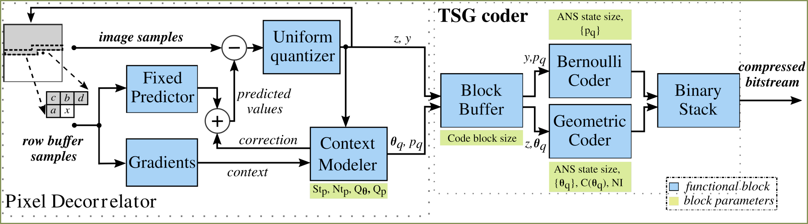
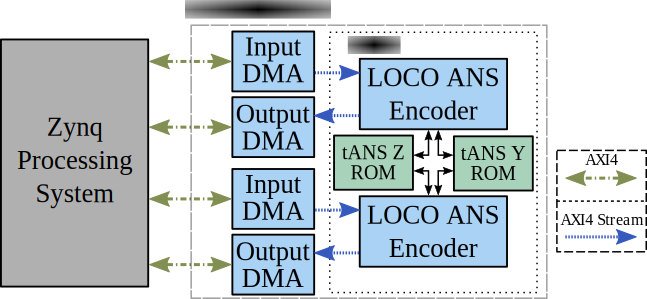

# FPGA based LOCO-ANS Hardware Encoder

This repository contains the source code resulting from the development of a hardware implementation of the LOCO-ANS encoder.




[LOCO-ANS](https://github.com/hpcn-uam/LOCO-ANS) was developed, based on JPEG-LS, with the aim to improve its coding efficiency but at a lower expense, compared to its extension. 
Targeting photographic images, LOCO-ANS is able to achieve in mean up to 1.6% and 6% higher compression than the standard for an error tolerance set to 0 (lossless) and 1, respectively. 
This improvement continues increasing with the error tolerance. 
Our experiments also show that LOCO-ANS compares favorably against state-of-the-art codecs like JPEG-XL and WebP, particularly in near-lossless, where it achieves higher compression ratios with a faster coding speed running on software.


Previous near-lossless JPEG-LS hardware encoder implementations, and many lossless only do not support run-length coding. 
LOCO-ANS completely replaces the coders with a high-performance, high coding efficiency tANS based coder.

 obtained by JPEG-LS, JPEG-LS without run mode and LOCO-ANS")

LOCO-ANS was designed to achieve high performance in hardware while improving JPEG-LS compression.
The hardware accelerators in this repository are capable of up to **40.5 MPixels/s** and **124 MPixels/s** per lane for Zynq 7020 and ZU+ XCZU7EV, respectively.
Compared to the single thread LOCO-ANS software implementation running in a 1.2GHz Raspberry Pi 3B, each hardware lane achieves 6.5 times higher throughput, even when implemented in an older and cost-optimized chip like the Zynq 7020. 
Moreover, **the implemented system is faster and achieves higher compression than the best previously available near-lossless JPEG-LS hardware implementation.**

There's also a lossless only version, which achieves a lower footprint and approximately 50% higher performance than the version that supports both lossless and near-lossless.
Interestingly, these great results were obtained applying High-Level Synthesis, describing the coder with C++ code, which tends to establish a trade-off between design time and quality of results. 


## LOCO-ANS HW encoder


### The LOCO-ANS hardware architecture
 obtained by JPEG-LS, JPEG-LS without run mode and LOCO-ANS")

*LOCO-ANS hardware high-level block diagram. In blue, modules running at the lower frequency and in red, modules running at the higher frequency.*

#### Implementation results:

*LOCO-ANS Encoder implementation metrics for a series of configurations and target parts:*

**Near-lossless (including lossless) double-lane encoders:**

|    Part | Coder config |    Clk0/1 (MHz) (1) |   LUT  |   FF   |  BRAM | DSP  | 
| ------  |    --------  |    --------         |  ----- |   ---- |  ---- |  --- |  
|  Z-7020 |    LOCO-ANS4 |    79.4 / 180.4     |   4580 |   4992 |  19.5 |   4  |  
|  Z-7020 |    LOCO-ANS6 |    81.1 / 182.2     |   4832 |   5160 |  24.0 |   4  | 
|  Z-7020 |    LOCO-ANS7 |    79.5 / 167.3     |   5095 |   5240 |  32.0 |   4  |
|  XCZU7EV|    LOCO-ANS4 |   248.3 / 502.2     |   6580 |   5954 |  19.0 |   4  |
|  XCZU7EV|    LOCO-ANS6 |   246.7 / 442.0     |   6867 |   6027 |  23.5 |   4  |
|  XCZU7EV|    LOCO-ANS7 |   234.1 / 395.1     |   6019 |   5780 |  33.5 |   4  |

- Support up to 8K wide images per lane
1)  Clk0 is the low frequency clock used for the pixel decorrelation process, while clk1 is the high frequency clock used for the coder. 

Performance is almost always determined by the low frequency clock, achieving clk0/2 Pixels/s/lane

**Lossless optimized double-lane encoders:**

|    Part | Coder config |    Clk0/1 (MHz) (1) |   LUT  |   FF   |  BRAM | DSP  | 
|:------ :|    --------  |    --------         |  ----- |   ---- |  ---- |  --- | 
|  Z-7020 | LOCO-ANS4-LS |    65.0 / 183.1     |   3979 |   4160 |  16.5 |   2  |
|  Z-7020 | LOCO-ANS6-LS |    64.3 / 186.0     |   4248 |   4298 |  21.0 |   2  |
|  Z-7020 | LOCO-ANS7-LS |    62.8 / 166.6     |   4572 |   4373 |  29.0 |   2  |
| XCZU7EV | LOCO-ANS4-LS |    188.4 / 500.5    |   4706 |   4949 |  19.0 |   2  | 
| XCZU7EV | LOCO-ANS6-LS |    187.1 / 447.0    |   4515 |   4225 |  21.0 |   2  |
| XCZU7EV | LOCO-ANS7-LS |    185.2 / 387.5    |   5415 |   5329 |  31.5 |   2  | 


- Support up to 8K wide images per lane
1)  Clk0 is the low frequency clock used for the pixel decorrelation process, while clk1 is the high frequency clock used for the coder. 

Performance is almost always determined by the low frequency clock, achieving clk0 Pixels/s/lane

The XCZU7EV LOCO-ANS7-LS performance is determined by the high frequency clock, achieving, on average: clk1/2.3 Pixels/s/lane


## Publications

### Hardware Implementation 

Submitted to Electronics journal (MDPI), currently under revision

Title: "An FPGA-based LOCO-ANS Implementation for Lossless andNear-Lossless Image Compression Using High-Level Synthesis"

Authors: Tobías Alonso, Gustavo Sutter, and Jorge E. López de Vergara


### Codec design and evaluation

Title: "LOCO-ANS: An optimization of JPEG-LS using anefficient and low complexity coder based on ANS"

Authors: Tobías Alonso, Gustavo Sutter, and Jorge E. López de Vergara

[IEEE ACCESS publication](https://ieeexplore.ieee.org/document/9499046)
[GitHub Repository](https://github.com/hpcn-uam/LOCO-ANS)


## Repository contents:
- modules: High Level Synthesis code to create and test the encoder accelerator system
- HW_platforms: scripts to obtain the FPGA bitstreams
  - LOCO_ANS_double_lane_1: platform with two lanes of the LOCO-ANS coder supporting near-lossless coding
  - LOCO_ANS_LS_double_lane_1: platform with two lanes of the LOCO-ANS coder supporting optimized for lossless coding
- notebooks: 
  - coder_config_gen.ipynb: Jupyter notebook to select coder parameters and generate the configuration file and tANS tables
- SW: Software to test the hardware platforms
  - linux/LOCO_ANS/pynq: PYNQ driver
    - loco_ans_codec: software sources of the codec used to verify the hardware encoder.


## Compression comparison vs JPEG_LS
Dataset: [Rawzor](https://imagecompression.info/test_images/)
Gray 8 bit images where used

Photographic images of the dataset:


## Build instructions

Prerequisites:
- Vitis 2021.1 (to work with previous versions, some HLS pragmas and build scripts need to be adapted)
- [optional] To use the Pynq driver, pynq python module needs to be installed in the linux running on the SoC
- [optional] Jupyter: to change the coder configuration


### Build Modules and Hardware platform



To build the platforms run: 
``` bash
make BOARD={board_name} {platform}
``` 

Platforms:
- LOCO_ANS_double_lane_1 (default): platform with two lanes of the LOCO-ANS coder supporting near-lossless coding
- LOCO_ANS_LS_double_lane_1: platform with two lanes of the LOCO-ANS coder supporting optimized for lossless coding

Currently supported boards:
- pynq_z2 (default)
- zcu104


### Test 
To test the platforms:
- Linux with pynq: Simplest way is to get a prebuilt image from: [http://www.pynq.io/board.html ]
- Copy the linux/LOCO_ANS/pynq folder to the RFS. Choose a path that would me accessible to the Jupyter server. For example, for the prebuilt pynq images: `/home/xilinx/jupyter_notebooks` 
- Build the software codec for verification:
  - On the embedded Linux: run `make release` inside of the `pynq/loco_ans_codec` folder you copied
  -  If you change the codec configuration, you'll need to copy the sw codec source and build it again

- Copy the ".bit" and ".hwh" files of the chosen hardware platform. Choose a path that would me accessible to the Jupyter server
- Run test: 
  - Open and run the `pynq/LOCO_encoder_test.ipynb` notebook
