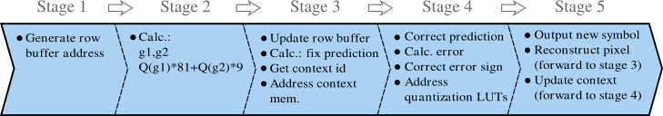
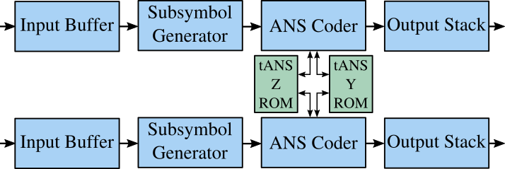
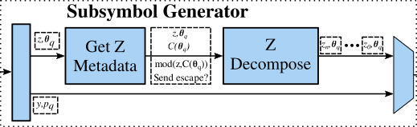
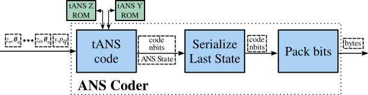

# Platform modules sources

High Level Synthesis code to create and test the encoder accelerator system

## Encoder arch:

 obtained by JPEG-LS, JPEG-LS without run mode and LOCO-ANS")

### Pixel Decorrelator pipeline

### Double lane TSG coder Hierarchy 

This module can receive the output of two independent Pixel Decorrelators and process it without clock penalties

#### Input buffers

#### Subsymbol Generator

#### tANS coder

